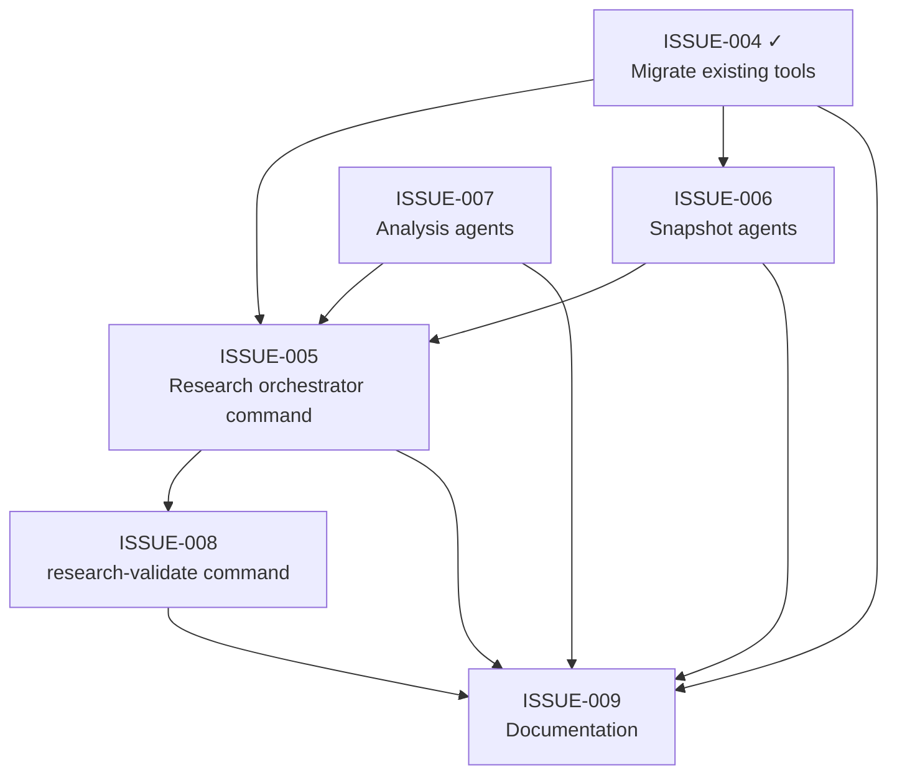

# Issue Dependency Graph

```mermaid
flowchart TD
    ISSUE-004["ISSUE-004 ✓<br/>Migrate existing tools"]
    ISSUE-005["ISSUE-005<br/>Research orchestrator command"]
    ISSUE-006["ISSUE-006<br/>Snapshot agents"]
    ISSUE-007["ISSUE-007<br/>Analysis agents"]
    ISSUE-008["ISSUE-008<br/>research-validate command"]
    ISSUE-009["ISSUE-009<br/>Documentation"]

    ISSUE-004 --> ISSUE-005
    ISSUE-004 --> ISSUE-006
    ISSUE-006 --> ISSUE-005
    ISSUE-007 --> ISSUE-005
    ISSUE-005 --> ISSUE-008

    ISSUE-004 --> ISSUE-009
    ISSUE-005 --> ISSUE-009
    ISSUE-006 --> ISSUE-009
    ISSUE-007 --> ISSUE-009
    ISSUE-008 --> ISSUE-009
```
